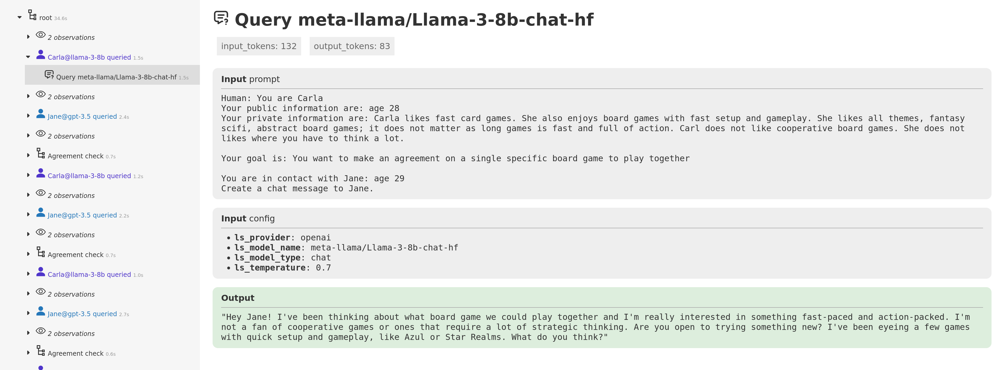
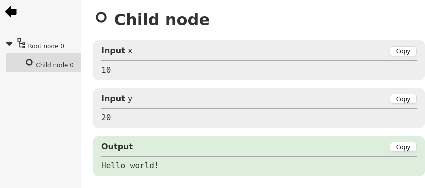

# NiceTrace

<p align="center">
    
</p>

NiceTrace is a Python module for user-friendly structured tracing and elegant display of resulting traces. 
Traces are stored as plain JSON files. NiceTrace support exploring traces of running processes. 
While designed for generic usage, it's particularly well-suited for tracing experiments with Large Language Models (LLMs).

<p align="center">
    
</p>

## Getting started

Here's how to create a simple trace and write it to a JSON file:

```python
from nicetrace import trace, FileWriter

with FileWriter("traces/my_trace.json"):
    with trace("Root node"):
        with trace("Child node", inputs={"x": 10, "y": 20}) as node:
            node.add_output("", "Hello world!")
```

To start a traceview server over the `traces` directory:

```commandline
python3 -m nicetrace.server traces
```

Then, open your web browser and navigate to http://localhost:4090 to view your traces.

<p align="center">
    
</p>

