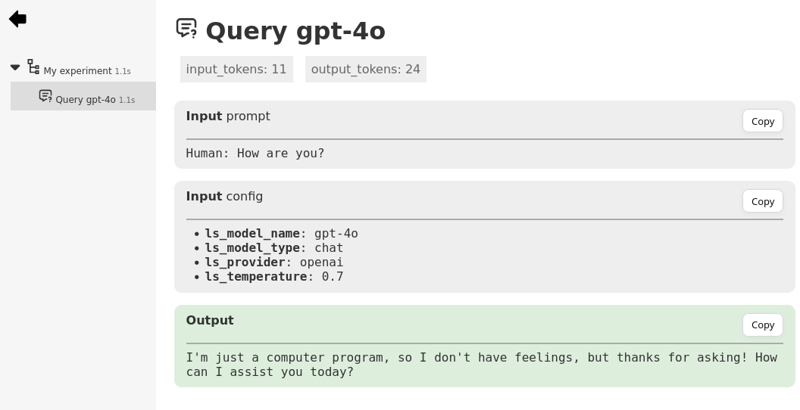

## Integration with LangChain:

NiceTrace provide an integration with LangChain that automatically logs all invodes of a model.

```python
from nicetrace import trace
from nicetrace.ext.langchain import Tracer

tracer = Tracer()

# # Create NiceTrace Tracer for LangChain & Register the tracer within the model
model = langchain_openai.chat_models.ChatOpenAI(
    model="gpt-4o", callbacks=[Tracer()]),

with trace("My experiment"):
    # Call the model. The call is automatically traced under the "My experiment" node.
    model.invoke("How are you?")
```


