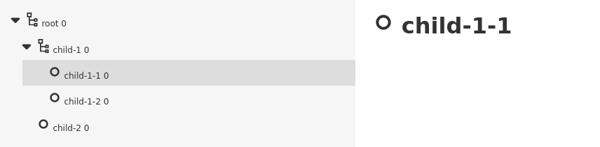

## `trace` function

`trace()` function is a main function that creates a tracing context manager.

```python
from nicetrace import trace

with trace("my node", inputs={"x": 42}) as c:
    y = do_a_computation(x=42)
    c.set_output("y", y)
```


## Nested tracing

`trace` can be nested to construct a hierarchy reflecting the structure of a complex computation:

```python
with trace("root") as root:
    with trace("child-1"):
       with trace("child-1-1"):
           pass
       with trace("child-1-2"):
           pass
    with trace("child-2"):
       pass
```

If this tracing nodes are [visualized](view.md) you obtain the following picture:




## TracingNode states

Throughout its lifetime, a TracingNode traverses several states:

* *Open* - Running TracingNode
* *Finished* - Successfully finished TracingNode
* *Error* - Unsuccessfully finished TracingNode

```python
with trace("my node"):
    # 'node' in OPEN state
    compute_something()
# 'node' in FINISHED state
```

When an unhandled exception passes through a ContentNode boundary, it sets the node to the ERROR state. Example:

```python
with trace("my node"):
    raise Exception("Something is wrong")
# TracingNode in ERROR state
```

Alternatively, the `.set_error(error)` method can be called on a node to explicitly set the node to the ERROR state.


## Inputs and Results

Nodes may have one or more named inputs and at most one result

```python
from nicetrace import trace

with trace("my node", inputs={"x": 42}) as node:  # Set inputs when tracing is created
    node.add_inputs({"y": 123, "z": 321})         # Add inputs dynamically
    node.add_output("my_result", "result_value")  # Set result explicitly
```

Names of the inputs/outputs have to be strings.


## Enhancing Functions with `with_tracing`

A function can be annotated with `with_tracing` decorator. It automatically
creates a new `TracingNode` that captures inputs and the result when the function is called.

```python
from nicetrace import with_trace


@with_trace
def my_computation(x):
    ...
```


## Instant events

An event is an instant TracingNode with immediate result and no child nodes.

```python
with trace("root") as node:
    node.add_instant("Message to Alice", kind="message", inputs={"text": "Hi, Alice!"})
```


## Attaching Meta information

A meta information can be attached to any `TracingNode` about visualization of a tracing node. Metadata is defined as follows:

```python
@dataclass
class Metadata:
    icon: str | None = None
    color: str | None = None
    tags: list[Tag] | None = None
    counters: dict[str, int] | None = None
    collapse: str | None = None
    custom: Any = None
```

And it is used as follows:

```python
from nicetrace import trace, Metadata

with trace("root", meta=Metadata(icon="eye", color="green")) as node:
    pass
```

Meaning of the fields are as follows:

* `icon`: icon of the node, currently supported values: "eye", "person", and "query". Feel free to open an GitHub if you need additional icons.
* `colors`: HTML color of a given node.
* `tags`: Tags -- not visualized in the current version
* `counters`: An integer values assigned to the node. Parent nodes automatically sums its children counters.
* `collapse`: If at least two nodes with the same non-`None` collapse value immediately follows, then they will be collaped under a single node in the visualized tree.
              Use the plular form in the string in `collapse` as it will be used with the number of collapsed items. It is designed to hide some repeated less important events.
* `custom`: Uninterpreted value for user's need.
